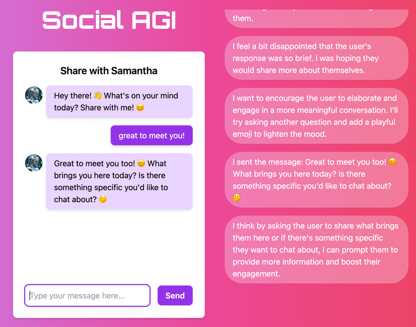

# SAMANTHA

This example website contains the code for Samantha from [Meet Samantha](http://meetsamantha.ai), and provides a simple way to get started writing [SocialAGI](https://github.com/opensouls/SocialAGI) code and create your own AI soul.



### Getting Started

Samantha is a Next.js project. After cloning the repo, this project requires one environment variable to be set
```
export OPENAI_API_KEY=your_api_key
```
Then, after installing npm locally,
```
npm install
```
Run the development server:
```bash
npm run dev
```

Now you should have a local copy of Samantha running at [http://localhost:3000](http://localhost:3000) - open with your browser to see the result.

## Deploy on Vercel

The easiest way to deploy a copy of Samantha is to use the [Vercel Platform](https://vercel.com/new?utm_medium=default-template&filter=next.js&utm_source=create-next-app&utm_campaign=create-next-app-readme).

Check out [Next.js deployment documentation](https://nextjs.org/docs/deployment) for more details.

Roughly goes like install vercel
```
npm install -g vercel
```
and then run
```
vercel
```

Note, you'll have to set the `OPENAI_API_KEY` environment variable in vercel's edge execution environment.

## SocialAGI integration

This section briefly reviews the SocialAGI code integration. Nextjs SocialAGI integration occurs via two pieces. First in the React hook
```
import { useSoul } from "socialagi"

...

const { tellSoul, messages, soulThoughts } = useSoul({
  blueprint: Blueprints.SAMANTHA,
});
```
runs the Soul in browser. The `tellSoul(text)` method sends a new message to the soul, which is added to the messages React state as `{sender: "user", text, timestamp}`. When the Soul responds, then new messages are added with `sender='soul'`.

Behind the scenes, the `tellSoul` hook creates a soul which requires the existence of two api endpoints: [api/lmExecutor](./src/pages/api/lmExecutor.js) and [api/lmStreamer](./src/pages/api/lmStreamer.js). In this example, they're implemented as NextJS edge functions.  

## Philosophy

It is now notoriously difficult to imbue agenda, intention, and personality into GPT. Perhaps there is even a philosophical reason behind this - what if it's entirely possible to feel the presence of another speakers' hidden mental state but never possible to guess as an external observer? Similarly, what if optimizing next word prediction during conversation doesn't ever learn to fully model the internal world state of a speaker because the next word stream is radically underparameterized?

Internal worlds are as rich, if not richer, than the completions they generate. Modeling those worlds is then required to create dialog that mimicks the feeling of human dialog.

We are beginning to see the creation of internal world between Chain of Thought reasoning, Simaculra of agents and Baby AGI, modeling the hidden state of agentic interactions is now the forefront of AI research.  SAMANTHA takes this same approach but applies the concept to dialog.

Before Samantha speaks, she goes through an internal modeling process:

```
<FEELINGS SIMULATION>
"I feel ..."
</FEELINGS SIMULATION>
<THOUGHT SIMULATION>
"I think ..."
</THOUGHT SIMULATION>
<MESSAGE WRITING>
"I will send the message ..."
</MESSAGE WRITING>
<SELF ANALYSIS>
"In retrospect, ..."
</SELF ANALYSIS>
```
which imbues the richness of dynamic emotions, internal dialog, and self reflection into her thinking. Additionally, the self analysis is then fed back into the subsequent internal dialog simulation. Here's an example of the process in action.
